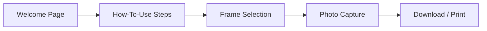
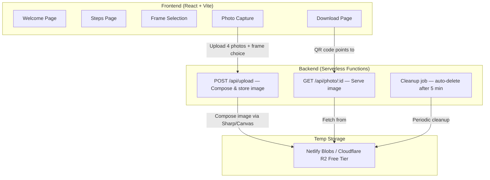

# FunBox — Photobooth App Plan

> A web-based photobooth application designed for self-service photo booths using a PC/laptop with an external webcam. Users select a frame, capture 4 photos with a countdown timer, and download the finalized image via QR code.

---

## 1. Product Overview

### 1.1 What is FunBox?

FunBox is a browser-based photobooth app that turns any PC + webcam setup into a self-service photo booth. It runs entirely in the browser (no native installs required) and produces a classic 2×2 photo strip that users can download via QR code or print.

### 1.2 User Flow



| Step | Screen | Description |
|------|--------|-------------|
| 1 | **Welcome** | Short welcome text + "Start" button |
| 2 | **How-To-Use** | Step-by-step instructions (3–4 steps with icons) |
| 3 | **Frame Selection** | Choose between **White Frame** or **Black Frame** (2×2 layout) |
| 4 | **Photo Capture** | Split view: live camera + frame preview. 5-second countdown per shot. 4 shots total. Retake supported. |
| 5 | **Download / Print** | Shows finalized image + QR code to download. Option to print. |

### 1.3 Key Features (MVP)

- Browser-based webcam access via `getUserMedia` API
- 5-second visible countdown before each capture
- 2×2 photo layout in two frame styles (white / black)
- Retake individual photos before finalizing
- Final image: **1200×1800 px**, JPEG @ 75% quality
- QR code linking to downloadable image
- Temporary storage — auto-delete after **5 minutes**
- Responsive enough for standard PC/laptop screens (optimized for landscape)

---

## 2. UI / UX Design

### 2.1 Design System (inspired by reference images)

The UI style is inspired by the attached "Bruddle" dashboard reference — a **dark, modern, premium** aesthetic.

| Token | Value |
|-------|-------|
| **Background (primary)** | `#0D0D0D` (near black) |
| **Background (card/surface)** | `#1A1A1A` |
| **Background (elevated)** | `#252525` |
| **Border** | `#2E2E2E` |
| **Text primary** | `#FFFFFF` |
| **Text secondary** | `#A0A0A0` |
| **Accent primary** | `#A855F7` (purple) |
| **Accent secondary** | `#F5C542` (gold/yellow) |
| **Success** | `#22C55E` |
| **Error/Danger** | `#EF4444` |
| **Font** | `Inter` (Google Fonts) |
| **Border radius** | `12px` (cards), `8px` (buttons) |

### 2.2 Page Layouts

#### Welcome Page
- Full-screen dark background
- Centered card with FunBox logo, welcome text, and a large purple "Start" button
- Subtle gradient or glow behind the logo

#### How-To-Use Page
- Horizontal stepper or stacked cards showing 3–4 steps
- Each step has an icon, title, and short description
- "Continue" button at the bottom

#### Frame Selection Page
- Two large preview cards side-by-side
- **Card 1:** White frame preview (2×2 grid, white borders)
- **Card 2:** Black frame preview (2×2 grid, black borders)
- Selecting a card highlights it with a purple border/glow
- "Next" button

#### Photo Capture Page (two-column layout)
- **Left column (60%):** Live camera feed with large countdown overlay (5→0), shutter button below
- **Right column (40%):** Frame preview showing captured photos filling in progressively. Each filled slot is clickable for retake (shows a small ✕ icon on hover). "Done" button appears when all 4 slots are filled.

#### Download / Print Page
- Finalized framed image preview (centered)
- QR code (large, scannable) linking to the download URL
- "Print" button and "Start Over" button
- Timer notice: "This photo will be available for 5 minutes"

---

## 3. Technical Architecture

### 3.1 High-Level Architecture



### 3.2 Tech Stack

| Layer | Technology | Why |
|-------|-----------|-----|
| **Frontend framework** | React 18 + Vite | Fast dev, SPA routing, great DX |
| **Routing** | React Router v6 | Client-side page navigation |
| **Camera** | `navigator.mediaDevices.getUserMedia()` | Native browser API, no library needed |
| **Image composition** | HTML Canvas API (frontend) | Compositing 4 photos into the frame client-side |
| **QR Code** | `qrcode.react` library | Lightweight React QR code generator |
| **Styling** | Vanilla CSS with CSS custom properties | Full control, matches design system |
| **Font** | Inter (Google Fonts) | Clean, modern, matches reference |
| **Backend** | Netlify Functions (serverless) | Free tier, pairs with Netlify hosting |
| **Temp storage** | Netlify Blobs | Free, built-in to Netlify, key-value blob store |
| **Deployment** | Netlify | Familiar to user, free tier, CI/CD |

### 3.3 Frontend Structure

```
funbox/
├── public/
│   └── favicon.svg
├── src/
│   ├── main.jsx                  # Entry point
│   ├── App.jsx                   # Router setup
│   ├── index.css                 # Global styles & design tokens
│   ├── pages/
│   │   ├── WelcomePage.jsx
│   │   ├── StepsPage.jsx
│   │   ├── FrameSelectionPage.jsx
│   │   ├── CapturePage.jsx
│   │   └── DownloadPage.jsx
│   ├── components/
│   │   ├── CameraView.jsx        # Webcam feed + countdown
│   │   ├── FramePreview.jsx      # 2x2 frame with photo slots
│   │   ├── CountdownOverlay.jsx  # Full-screen countdown number
│   │   ├── ShutterButton.jsx     # Capture button
│   │   ├── QRCodeDisplay.jsx     # QR code component
│   │   └── StepCard.jsx          # Reusable step instruction card
│   ├── hooks/
│   │   └── useCamera.js          # Custom hook for camera management
│   └── utils/
│       ├── composeImage.js       # Canvas-based image compositing
│       └── api.js                # Upload / fetch API helpers
├── netlify/
│   └── functions/
│       ├── upload.js             # Receive composed image, store in Blobs
│       └── photo.js              # Serve image by ID
├── package.json
├── vite.config.js
└── netlify.toml
```

### 3.4 Key Frontend Logic

#### Camera Hook (`useCamera.js`)
```
- Request camera via getUserMedia({ video: { width: 1280, height: 720 } })
- Attach stream to <video> element ref
- capturePhoto() → draw video frame to offscreen canvas → return data URL
- cleanup() → stop all tracks on unmount
```

#### Image Composition (`composeImage.js`)
```
- Create canvas 1200×1800
- Draw frame background (white or black)
- Calculate 4 photo positions (2×2 grid with padding)
- Draw each photo into its slot (cropped/fitted)
- Export as JPEG blob at 75% quality
```

#### Countdown Flow
```
1. User clicks shutter button
2. Shutter button disabled
3. CountdownOverlay shows 5, 4, 3, 2, 1
4. At 0 → capture photo from camera
5. Photo appears in next empty frame slot
6. If all 4 filled → show "Done" button
```

### 3.5 Backend Logic

#### `POST /api/upload`
```
- Receives: JPEG blob (the finalized composed image)
- Generates unique ID (nanoid)
- Stores blob in Netlify Blobs with key = ID
- Stores metadata with TTL timestamp (now + 5 min)
- Returns: { id, url, expiresAt }
```

#### `GET /api/photo/:id`
```
- Looks up blob by ID
- If expired or not found → 404
- Returns image with Content-Type: image/jpeg
```

#### Cleanup Strategy
- **Option A (simple):** Check TTL on each GET request, delete if expired. No background job needed.
- **Option B (thorough):** Netlify Scheduled Function runs every 5 minutes, scans and deletes expired blobs.

> [!TIP]
> For MVP, Option A is sufficient and simpler. Expired photos simply return 404 and are lazily cleaned up.

### 3.6 Frame Specifications

Final output: **1200 × 1800 px**, JPEG, 75% quality.

```
┌─────────────────────────────┐
│         FRAME BORDER        │  ← 40px padding (white or black)
│  ┌──────────┐ ┌──────────┐  │
│  │  Photo 1 │ │  Photo 2 │  │  ← Each photo: ~540 × 400 px
│  │          │ │          │  │
│  └──────────┘ └──────────┘  │
│                             │  ← 20px gap between photos
│  ┌──────────┐ ┌──────────┐  │
│  │  Photo 3 │ │  Photo 4 │  │
│  │          │ │          │  │
│  └──────────┘ └──────────┘  │
│                             │
│       "FunBox" branding     │  ← Small text at bottom
│                             │
└─────────────────────────────┘
```

Exact dimensions (calculated for 1200×1800 canvas):

| Element | Value |
|---------|-------|
| Canvas | 1200 × 1800 px |
| Frame padding (sides) | 40 px |
| Frame padding (top) | 40 px |
| Frame padding (bottom) | 120 px (for branding) |
| Gap between photos | 20 px |
| Photo width | (1200 - 40×2 - 20) / 2 = **550 px** |
| Photo height | (1800 - 40 - 120 - 20) / 2 = **810 px** |
| Branding area | Bottom 120 px |

---

## 4. Deployment & Infrastructure

### 4.1 Free Tier Comparison

| Service | Free Tier | Pros | Cons |
|---------|----------|------|------|
| **Netlify** | 100 GB bandwidth, 300 build min/mo, Blobs storage, Serverless Functions | Familiar, all-in-one, Blobs for temp storage | Blob storage limits unclear at scale |
| **Vercel** | 100 GB bandwidth, Serverless Functions, Blob Storage | Great DX, fast | Less familiar to user |
| **Cloudflare Pages** | Unlimited bandwidth, Workers (100K req/day), R2 (10 GB free) | Most generous free tier | Slightly different API |

### 4.2 Recommended: Netlify (all-in-one)

Since you're familiar with Netlify, here's the recommended setup:

| Component | Netlify Feature |
|-----------|----------------|
| **Frontend hosting** | Netlify Sites (auto-deploy from Git) |
| **Serverless API** | Netlify Functions (Node.js) |
| **Temp image storage** | Netlify Blobs (key-value blob store, free) |
| **Custom domain** | Netlify DNS (free) |
| **HTTPS** | Automatic (free) |

### 4.3 Alternative: Cloudflare Pages + R2

If you need more generous free limits later:

| Component | Cloudflare Feature |
|-----------|-------------------|
| **Frontend hosting** | Cloudflare Pages (unlimited bandwidth) |
| **Serverless API** | Cloudflare Workers (100K req/day free) |
| **Temp image storage** | Cloudflare R2 (10 GB free, no egress fees) |

---

## 5. MVP Scope & Milestones

### Phase 1: Core App (MVP) — *This implementation*

| # | Feature | Priority |
|---|---------|----------|
| 1 | Welcome page | Must |
| 2 | How-to-use steps page | Must |
| 3 | Frame selection (white/black) | Must |
| 4 | Camera capture with countdown | Must |
| 5 | Frame preview with retake | Must |
| 6 | Image composition (client-side) | Must |
| 7 | Upload & temp storage | Must |
| 8 | QR code download | Must |
| 9 | Auto-cleanup (5 min TTL) | Must |
| 10 | Print button | Nice-to-have |

### Phase 2: Enhancements (Post-MVP)

- More frame designs (seasonal, themed)
- Stickers / text overlay before finalizing
- Photo filters (B&W, sepia, vintage)
- Multi-language support
- Admin panel (view stats, manage frames)
- Gallery mode (event-based galleries)
- Custom branding per event
- Email delivery option

---

## 6. Step-by-Step Implementation Plan

Below is the full implementation plan broken into 10 incremental steps. Each step includes what to build, how to test it locally, and the expected outcome. The idea is that after each step, you have a working (progressively more complete) app.

---

### Step 1: Project Scaffolding

**Goal:** Set up the project skeleton with Vite + React, install all dependencies, and verify the dev server runs.

**Actions:**

```bash
# Scaffold Vite + React project
cd /Users/wahyu/Documents/Projects/funbox
npx -y create-vite@latest ./ -- --template react

# Install app dependencies
npm install react-router-dom qrcode.react nanoid

# Install dev/backend dependencies
npm install --save-dev @netlify/blobs netlify-cli
```

**File changes:**
- Delete boilerplate (`App.css`, default `App.jsx` content, `assets/`)
- Create folder structure: `src/pages/`, `src/components/`, `src/hooks/`, `src/utils/`
- Create `netlify/functions/` directory
- Create `netlify.toml` with build config

**`netlify.toml`:**
```toml
[build]
  command = "npm run build"
  publish = "dist"
  functions = "netlify/functions"

[[redirects]]
  from = "/api/*"
  to = "/.netlify/functions/:splat"
  status = 200

[[redirects]]
  from = "/*"
  to = "/index.html"
  status = 200
```

**Local test:**
```bash
npm run dev
# → Open http://localhost:5173 — should show blank React app
```

**✅ Expected:** Dev server starts, blank page loads without errors.

---

### Step 2: Design System & Global Styles

**Goal:** Implement the full CSS design system — colors, typography, layout utilities, component base styles.

**Actions:**
- Add Inter font via Google Fonts in `index.html`
- Write `src/index.css` with all CSS custom properties (see Section 2.1)
- Define base styles: body, headings, buttons, cards, inputs
- Add utility classes: `.container`, `.flex-center`, `.grid-2col`, etc.
- Add animation keyframes: fade-in, scale-up, glow pulse

**Local test:**
```bash
npm run dev
# → Verify dark background, Inter font loaded, no visual glitches
```

**✅ Expected:** Dark themed blank page with Inter font applied.

---

### Step 3: Welcome Page + Router Setup

**Goal:** Create the Welcome page and set up React Router for all 5 pages.

**Actions:**
- Create `src/App.jsx` with `BrowserRouter` + routes for all 5 pages (placeholder components for pages not yet built)
- Create `src/pages/WelcomePage.jsx`:
  - Full-screen centered layout
  - FunBox logo/title with subtle glow effect
  - Welcome text paragraph
  - Large purple "Start" button → navigates to `/steps`
- Create `src/pages/WelcomePage.css`

**Local test:**
```bash
npm run dev
# → http://localhost:5173/ shows Welcome page
# → Click "Start" → navigates to /steps (placeholder page)
```

**✅ Expected:** Beautiful welcome screen with working navigation.

---

### Step 4: How-To-Use Steps Page

**Goal:** Build the step-by-step instruction page.

**Actions:**
- Create `src/components/StepCard.jsx` — reusable card with icon, step number, title, description
- Create `src/pages/StepsPage.jsx`:
  - Display 4 step cards:
    1. 📷 "Choose your frame" — Pick your favorite photo frame style
    2. 📸 "Strike a pose" — Stand in front of the camera and get ready
    3. ⏱️ "Smile for the countdown" — 5-second countdown, then snap!
    4. 📱 "Get your photos" — Scan the QR code to download
  - "Let's Go!" button → navigates to `/frames`

**Local test:**
```bash
npm run dev
# → http://localhost:5173/steps — shows 4 instruction cards
# → Click "Let's Go!" → navigates to /frames
```

**✅ Expected:** Clean step-by-step page with icons and descriptions.

---

### Step 5: Frame Selection Page

**Goal:** Let users choose between white and black frame styles.

**Actions:**
- Create `src/pages/FrameSelectionPage.jsx`:
  - Two side-by-side preview cards showing frame layouts
  - **Card 1:** White frame — white background, 2×2 grid with gray placeholder slots
  - **Card 2:** Black frame — black background, 2×2 grid with dark gray placeholder slots
  - Click to select → purple border/glow highlight on selected card
  - Store selection in React state (will be passed to Capture page)
  - "Next" button → navigates to `/capture` with frame choice in state/URL params

**Local test:**
```bash
npm run dev
# → http://localhost:5173/frames — shows 2 frame preview cards
# → Click a card → it highlights with purple border
# → Click "Next" → navigates to /capture
```

**✅ Expected:** Both frames render with clear visual distinction. Selection state works.

---

### Step 6: Camera Hook & Live Feed

**Goal:** Access the webcam and display the live camera feed on the Capture page.

**Actions:**
- Create `src/hooks/useCamera.js`:
  ```
  - Request camera: getUserMedia({ video: { width: 1280, height: 720, facingMode: 'user' } })
  - Attach stream to video element ref
  - capturePhoto(): draw current video frame to offscreen canvas → return data URL
  - Cleanup: stop all tracks on unmount
  - Error handling: camera denied, no camera found
  ```
- Create `src/components/CameraView.jsx`:
  - Renders `<video>` element with live feed
  - Mirrors the video horizontally (CSS `transform: scaleX(-1)`) for selfie-mode
  - Shows error message if camera access is denied
- Create `src/pages/CapturePage.jsx` (initial version):
  - Two-column layout (60% camera / 40% frame preview placeholder)
  - Left column: `CameraView` component
  - Right column: placeholder "Frame preview goes here"

**Local test:**
```bash
npm run dev
# → http://localhost:5173/capture
# → Browser asks for camera permission → Allow
# → Live camera feed appears in the left column
# Test with external webcam: plug in USB webcam before opening page
```

> [!IMPORTANT]
> **Camera selection:** If multiple cameras are detected, the browser typically defaults to the last-connected one. For the MVP, we use the default camera. Post-MVP can add a camera selector dropdown.

**✅ Expected:** Live camera feed visible. Works with both built-in and external webcams.

---

### Step 7: Countdown, Shutter & Frame Preview

**Goal:** Implement the full capture flow — shutter button, countdown overlay, and frame preview that fills progressively.

**Actions:**
- Create `src/components/ShutterButton.jsx`:
  - Large circular button (camera icon or ● symbol)
  - Click → triggers countdown
  - Disabled during countdown and when all 4 photos are taken
  - Pulse animation on hover

- Create `src/components/CountdownOverlay.jsx`:
  - Full-overlay on the camera feed area
  - Shows large number (5, 4, 3, 2, 1) with scale animation
  - At 0 → flash effect → trigger capture

- Create `src/components/FramePreview.jsx`:
  - 2×2 grid matching the selected frame style (white or black)
  - Empty slots show dashed border + camera icon
  - Filled slots show captured photo thumbnail
  - Hover on filled slot → shows ✕ overlay for retake
  - Click ✕ → clears that slot (photo removed, slot becomes empty again)

- Update `src/pages/CapturePage.jsx`:
  - State: `photos` array (4 slots, initially `null`)
  - State: `isCountingDown`, `countdownValue`
  - Wire up: ShutterButton → start countdown → CountdownOverlay → capturePhoto() → fill next empty slot
  - "Done" button (gold/yellow accent) appears when all 4 slots are filled → navigates to `/download`

**Countdown logic:**
```
shutter click → set isCountingDown=true, countdownValue=5
  → setInterval(1000ms): 5→4→3→2→1→0
  → at 0: capturePhoto(), add to photos array, isCountingDown=false
  → flash effect on camera view
```

**Local test:**
```bash
npm run dev
# → http://localhost:5173/capture (with frame selected)
# → Click shutter → countdown 5..4..3..2..1 visible → photo captured → appears in frame
# → Repeat 4 times → all slots filled → "Done" button appears
# → Hover on captured photo → ✕ icon → click to retake
# → Click "Done" → navigates to /download
```

**✅ Expected:** Full capture flow works. Countdown is smooth and visible. Photos fill the frame. Retake works.

---

### Step 8: Image Composition (Client-Side)

**Goal:** Compose the 4 captured photos into the final framed image (1200×1800 JPEG).

**Actions:**
- Create `src/utils/composeImage.js`:
  ```
  Input: 4 photo data URLs + frame style ('white' | 'black')
  Output: Blob (JPEG, 1200×1800px, 75% quality)

  Steps:
  1. Create offscreen canvas (1200×1800)
  2. Fill background with frame color (white #FFFFFF or black #1A1A1A)
  3. Load 4 photos as Image objects
  4. For each photo, calculate:
     - Crop to fit the target aspect ratio (550:810 ≈ 0.679)
     - drawImage() into the correct grid position
  5. Draw "FunBox" branding text at bottom center
     - White text on black frame, dark text on white frame
     - Font: 24px Inter, letter-spacing 4px
  6. Export: canvas.toBlob(callback, 'image/jpeg', 0.75)
  ```

  Grid positions:
  ```
  Photo 1: x=40,  y=40,   w=550, h=810
  Photo 2: x=610, y=40,   w=550, h=810
  Photo 3: x=40,  y=870,  w=550, h=810
  Photo 4: x=610, y=870,  w=550, h=810
  ```

- Integrate into capture flow: when "Done" is clicked on Capture page:
  1. Call `composeImage(photos, frameStyle)` → get JPEG blob
  2. Store blob in state / context
  3. Navigate to `/download`

**Local test:**
```bash
npm run dev
# → Complete 4 photo capture → click "Done"
# → Open browser DevTools > Console
# → Verify composed blob is created (log blob.size)
# → Optional: create object URL and open in new tab to visually inspect
#   URL.createObjectURL(blob) → paste in browser → check image is 1200x1800
```

**Quick verification script (paste in console):**
```javascript
// After composing, check dimensions
const img = new Image();
img.onload = () => console.log(`Dimensions: ${img.width}x${img.height}`);
img.src = URL.createObjectURL(composedBlob);
```

**✅ Expected:** Finalized image is 1200×1800 px, shows 4 photos in a 2×2 grid with the chosen frame color and "FunBox" branding.

---

### Step 9: Backend — Upload, Download & QR Code

**Goal:** Upload the composed image to Netlify Blobs, generate a download URL, and display a QR code.

**Actions:**

**Backend functions:**

- Create `netlify/functions/upload.js`:
  ```javascript
  // POST request
  // Receives: base64-encoded JPEG in body
  // Generates: nanoid for unique key
  // Stores: image blob in Netlify Blobs store "photos"
  // Stores: metadata JSON with { createdAt, expiresAt: now + 5min }
  // Returns: { id, url: "/api/photo/{id}", expiresAt }
  ```

- Create `netlify/functions/photo.js`:
  ```javascript
  // GET request with :id param (via query string or path)
  // Fetches metadata from Netlify Blobs
  // If not found or expired → return 404 JSON
  // If expired → also delete the blob (lazy cleanup)
  // If valid → fetch image blob, return with Content-Type: image/jpeg
  //            + Content-Disposition: attachment; filename="funbox-photo.jpg"
  ```

**Frontend:**

- Create `src/utils/api.js`:
  ```
  uploadPhoto(blob):
    - Convert blob to base64
    - POST to /api/upload
    - Return { id, url, expiresAt }

  getPhotoUrl(id):
    - Return full URL: `${window.location.origin}/api/photo/${id}`
  ```

- Create `src/components/QRCodeDisplay.jsx`:
  - Uses `qrcode.react` to render a large (256×256) QR code
  - QR value = full download URL

- Create `src/pages/DownloadPage.jsx`:
  - On mount: calls `uploadPhoto(composedBlob)` → gets download URL
  - Shows loading spinner during upload
  - After upload:
    - Finalized image preview (scaled down)
    - Large QR code
    - "Download" button (direct link)
    - "Print" button (triggers `window.print()`)
    - "Start Over" button → navigates back to `/`
  - Shows countdown timer: "Your photo expires in X:XX"
  - Timer updates every second, counts down from 5:00

**Local test with Netlify CLI:**

```bash
# Install Netlify CLI globally (if not already)
npm install -g netlify-cli

# Run locally with Netlify functions support
netlify dev
# → This starts BOTH Vite dev server AND Netlify Functions
# → App available at http://localhost:8888 (proxied)
```

> [!IMPORTANT]
> **You must use `netlify dev` instead of `npm run dev` to test the backend functions locally.** Vite alone cannot serve Netlify Functions. `netlify dev` proxies both the frontend and the functions together.

**Test procedure:**
```bash
netlify dev
# → Complete full flow: Welcome → Steps → Frame → Capture 4 photos → Done
# → Download page: verify loading spinner appears → then QR code + image
# → Scan QR code with phone → verify image downloads
# → OR open the download URL in a new tab → verify JPEG downloads
# → Wait 5+ minutes → try download URL again → verify 404 response
```

**✅ Expected:** Full end-to-end flow works locally. QR code is scannable and the photo downloads correctly.

---

### Step 10: Polish, Edge Cases & Final Testing

**Goal:** Handle edge cases, polish the UI, and do final comprehensive testing.

**Actions:**
- **Camera error handling:**
  - No camera found → show friendly error message + "Try Again" button
  - Camera permission denied → show instructions to enable camera access
  - Camera disconnected mid-session → show error + option to retry

- **Responsive adjustments:**
  - Ensure Capture page works on both 16:9 and 16:10 screens
  - Test at common resolutions: 1920×1080, 1366×768, 1280×800

- **Loading states:**
  - Spinner during camera initialization
  - Spinner during image upload
  - Skeleton placeholders for QR code

- **Animation polish:**
  - Page transition fade effects
  - Smooth countdown number scaling
  - Shutter flash effect (brief white overlay)
  - Button hover/active states with micro-animations

- **Accessibility:**
  - Keyboard navigation (Tab through buttons)
  - Focus outlines on interactive elements
  - Alt text on images

- **SEO / Meta:**
  - Page title: "FunBox — Photo Booth"
  - Meta description
  - Favicon

---

## 7. Local Testing Guide

### Prerequisites

```bash
# Required
node -v    # v18+ recommended
npm -v     # v9+

# Install Netlify CLI
npm install -g netlify-cli
```

### Running Locally

There are **two** ways to run locally, depending on what you're testing:

#### Frontend only (no backend):
```bash
cd /Users/wahyu/Documents/Projects/funbox
npm run dev
# → http://localhost:5173
# ✅ Use for: UI development, styling, page layouts, camera testing
# ❌ Cannot test: upload, download, QR code (no serverless functions)
```

#### Full stack (frontend + backend):
```bash
cd /Users/wahyu/Documents/Projects/funbox
netlify dev
# → http://localhost:8888
# ✅ Use for: full end-to-end testing, upload/download, QR code
# ⚙️ Netlify CLI auto-detects Vite and proxies everything
```

### Local Test Checklist

| # | Test Case | How to Test | Expected Result |
|---|-----------|-------------|-----------------|
| 1 | Dev server starts | `npm run dev` | No errors, page loads |
| 2 | Welcome page renders | Open `/` | Logo, text, Start button visible |
| 3 | Navigation flow | Click through all pages | All 5 pages accessible |
| 4 | Camera feed | Open `/capture` | Live camera feed visible |
| 5 | External webcam | Plug in USB webcam, refresh | External camera feed shown |
| 6 | Countdown | Click shutter | 5→4→3→2→1 overlay + capture |
| 7 | Frame filling | Take 4 photos | Each photo fills a slot in preview |
| 8 | Retake | Click ✕ on a filled slot | Slot clears, can recapture |
| 9 | Image composition | Click "Done" after 4 photos | Composed image created |
| 10 | Upload (needs `netlify dev`) | Reaches download page | Image uploaded, QR appears |
| 11 | QR download | Scan QR with phone | JPEG image downloads |
| 12 | Expiry | Wait 5 min, try download URL | Returns 404 |
| 13 | Production build | `npm run build` | No errors in `dist/` |
| 14 | Print | Click "Print" on download page | Browser print dialog opens |

### Debugging Tips

```bash
# Check if camera is accessible
# Open Chrome DevTools → Console → paste:
navigator.mediaDevices.enumerateDevices().then(d => console.table(d.filter(x => x.kind === 'videoinput')))

# Check Netlify Functions logs
netlify dev
# → Function logs appear directly in your terminal

# Test upload function directly
curl -X POST http://localhost:8888/api/upload \
  -H "Content-Type: application/json" \
  -d '{"image":"data:image/jpeg;base64,/9j/4AAQ..."}'

# Check blob storage (local)
# Netlify CLI uses a local file-based blob store at .netlify/blobs
ls -la .netlify/blobs/
```

---

## 8. Deployment Guide

### 8.1 Pre-Deployment Checklist

- [ ] All 10 implementation steps completed
- [ ] Full flow tested locally with `netlify dev`
- [ ] Production build succeeds: `npm run build`
- [ ] No console errors in browser
- [ ] Camera works with external webcam
- [ ] QR code download works end-to-end
- [ ] Expiry (5 min TTL) works correctly

### 8.2 Deploy to Netlify (Step-by-Step)

#### Option A: Deploy via Git (Recommended)

**1. Push to GitHub:**
```bash
cd /Users/wahyu/Documents/Projects/funbox

# Initialize git repo
git init
git add .
git commit -m "Initial commit: FunBox photobooth MVP"

# Create repo on GitHub (via CLI or web)
gh repo create funbox --public --source=. --push
# OR manually:
git remote add origin https://github.com/YOUR_USERNAME/funbox.git
git push -u origin main
```

**2. Connect to Netlify:**
1. Go to [app.netlify.com](https://app.netlify.com)
2. Click **"Add new site"** → **"Import an existing project"**
3. Select **GitHub** → authorize → choose the `funbox` repo
4. Netlify auto-detects settings from `netlify.toml`:
   - Build command: `npm run build`
   - Publish directory: `dist`
   - Functions directory: `netlify/functions`
5. Click **"Deploy site"**
6. Wait for build to complete (~1-2 minutes)

**3. Verify deployment:**
```
# Your site will be at: https://random-name.netlify.app
# Test the full flow on the deployed URL
# Scan QR code → verify it points to the Netlify URL
```

#### Option B: Manual Deploy (Quick one-off)

```bash
cd /Users/wahyu/Documents/Projects/funbox

# Build production bundle
npm run build

# Deploy to Netlify
netlify deploy --prod --dir=dist --functions=netlify/functions
# → Follow prompts to link/create a site
# → Outputs the live URL
```

### 8.3 Post-Deployment Configuration

**Custom domain (optional):**
1. In Netlify dashboard → **Domain settings** → **Add custom domain**
2. Add your domain (e.g., `funbox.yourdomain.com`)
3. Update DNS records as instructed
4. HTTPS is automatically enabled

**Environment variables (if needed):**
- Currently no env vars are required for MVP
- If adding API keys later: Netlify dashboard → **Site settings** → **Environment variables**

### 8.4 Continuous Deployment

Once connected via Git, **every push to `main` triggers auto-deploy:**

```bash
# Make changes → commit → push → auto-deployed
git add .
git commit -m "Fix: improve countdown animation"
git push origin main
# → Netlify auto-builds and deploys in ~1-2 min
```

### 8.5 Production Testing Checklist

| # | Test | How | Expected |
|---|------|-----|----------|
| 1 | Site loads | Open Netlify URL | Welcome page renders |
| 2 | HTTPS | Check URL bar | 🔒 Secure connection |
| 3 | Camera on HTTPS | Allow camera | Camera feed works (HTTPS required for camera in production) |
| 4 | Full flow | Welcome → Download | All pages work correctly |
| 5 | QR from phone | Scan QR code | Photo downloads on phone |
| 6 | Cross-browser | Test Chrome, Firefox, Edge | All browsers work |
| 7 | Functions | Upload a photo | `/api/upload` returns success |
| 8 | Expiry | Wait 5 min, retry URL | Returns 404 |
| 9 | Performance | Check page load time | < 3 seconds |
| 10 | Blob cleanup | Monitor Netlify Blobs usage | Storage doesn't grow unbounded |

> [!WARNING]
> **Camera requires HTTPS in production.** `getUserMedia()` only works on `https://` or `localhost`. Netlify provides free HTTPS automatically, so this is handled. If you use a custom domain, make sure HTTPS is enabled before testing camera access.

---

## 9. Dependencies

| Package | Version | Purpose |
|---------|---------|---------|
| `react` | ^18 | UI framework |
| `react-dom` | ^18 | React DOM renderer |
| `react-router-dom` | ^6 | Client-side routing |
| `qrcode.react` | ^4 | QR code generation |
| `nanoid` | ^5 | Unique ID generation for photo keys |
| `@netlify/blobs` | ^8 | Netlify Blobs SDK for temp storage |
| `netlify-cli` | latest | Local dev server + deployment CLI |

---

> [!IMPORTANT]
> All image composition happens **client-side** using the Canvas API. The backend only stores and serves the final composed JPEG. This keeps the architecture simple and serverless-friendly.
